<h3><code>lovepreet@github ~ $ ./contributions.sh</code></h3>

  

<h3><code>lovepreet@github ~ $ whoami</code></h3>
<table>
  <tr>
    <td valign="top"></td>
    <td valign="top"></td>
  </tr>
</table>

 

<h3><code>lovepreet@github ~ $ ls ~/projects</code></h3>

<a href="https://github.com/callmelovepreet/LEAP-Public"><code>LEAP</code></a> ·
<a href="https://github.com/callmelovepreet/predicting_movie_success"><code>predicting_movie_success</code></a> ·
<a href="https://github.com/callmelovepreet/TensorTonic-Solutions"><code>TensorTonic-Solutions</code></a>

  

<a href="https://x.com/callmelovepreet"><code>x.com/callmelovepreet</code></a>

<!--
How this works: every image above is a self-contained animated SVG generated by
scripts/. The heatmap is refreshed daily by .github/workflows/update-profile-art.yml.
Regenerate the portrait or card locally after changing source-photo.jpg or
data/profile_info.json:

  pip install -r scripts/requirements-portrait.txt
  python scripts/prep_photo.py source-photo.jpg
  python scripts/make_ascii_svg.py
  python scripts/make_info_card.py
-->
